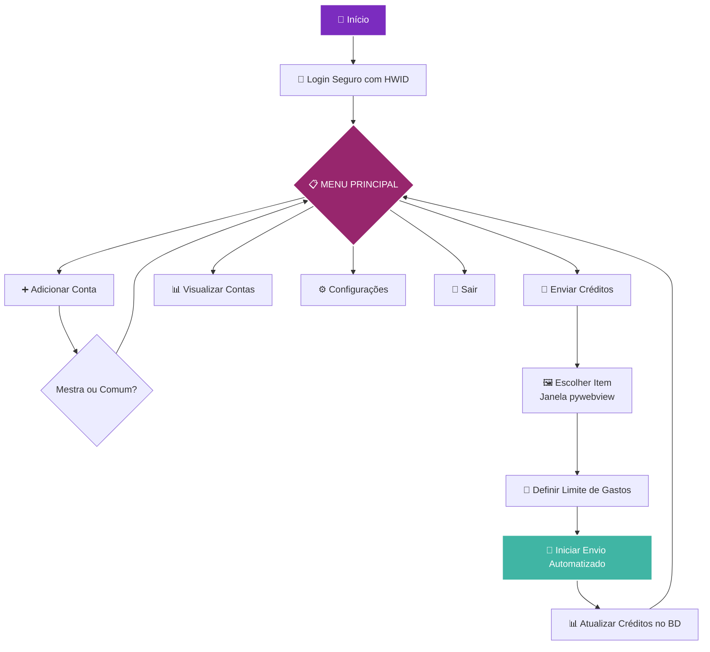
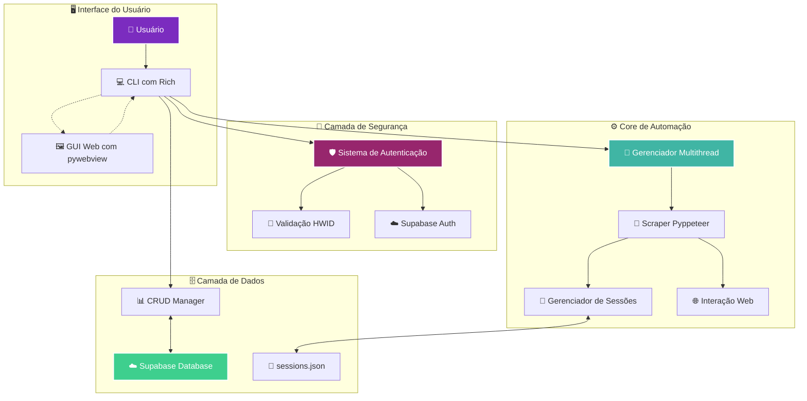

# 🤖 UbiOver CLI

<div align="center">
  
</div>

<div align="center">
  
  
  
  
  
  
  
  
</div>

---

## 🎬 Demonstração em Ação

<div align="center">
  <em>A interface cyberpunk do UbiOver CLI, construída com Rich.</em>
  <br><br>
  
</div>

---

## 📋 Sobre o Projeto

**UbiOver CLI** é uma poderosa aplicação de console (CLI) com uma **interface web integrada** para automatizar o gerenciamento de contas e o envio de créditos R6. Construído com uma stack de tecnologias modernas:

- **Rich** - Interface interativa e visualmente rica no terminal
- **pywebview** - GUI renderizada com HTML/CSS/JS para seleção visual de itens  
- **Supabase** - Backend robusto para banco de dados e autenticação segura
- **Pyppeteer** - Automação e web scraping avançado

A segurança é um pilar central, com um sistema de login que valida a identidade do usuário através de **HWID (Hardware ID)**, garantindo que o acesso seja restrito a dispositivos autorizados.

---

## ✨ Funcionalidades Principais

<table>
<tr>
<td width="50%">

### 🔐 Segurança & Autenticação
- **Login com Supabase** e verificação de HWID
- **Validação de dispositivos** autorizados
- **Sessões seguras** com tokens criptografados

### 🎮 Automação Inteligente
- **Pyppeteer** para automação web robusta
- **Multithread** para operações não-bloqueantes
- **Gerenciamento de sessões** persistente

</td>
<td width="50%">

### 💼 Gerenciamento CRUD
- **Criar, visualizar, editar e excluir** contas
- **Contas mestras** (origem) e **comuns** (destino)
- **Sincronização automática** com banco de dados

### 🖥️ Interface Híbrida
- **CLI rápido** com Rich para navegação
- **GUI intuitiva** com pywebview para seleções
- **Experiência de usuário** otimizada

</td>
</tr>
</table>

---

## 🔄 Fluxo de Funcionamento

O fluxo de operação foi projetado para ser intuitivo e direto, guiando o usuário em cada etapa do processo.



### Passo a Passo Detalhado:

1. **🔐 Autenticação:** Login validado pelo Supabase com verificação HWID
2. **📋 Menu Principal:** Interface centralizada para todas as operações
3. **➕ Gerenciamento:** Adicionar contas mestras (origem) ou comuns (destino)
4. **🛒 Seleção:** Interface web para escolha visual de itens
5. **💸 Configuração:** Definir limites de gastos e parâmetros
6. **🤖 Automação:** Processo automatizado em thread separada
7. **📊 Atualização:** Sincronização automática dos saldos no banco
8. **✅ Finalização:** Relatório de sucesso e retorno ao menu

---

## 🏗️ Arquitetura do Sistema

O sistema integra CLI e GUI para uma experiência completa e eficiente.



---

## 📦 Estrutura do Projeto

```
📁 UbiOver-CLI/
├── 🐍 main.py                 # Ponto de entrada da aplicação
├── 📁 core/
│   ├── 🔐 auth.py             # Sistema de autenticação (Supabase + HWID)
│   ├── 🤖 scraper.py          # Engine de automação (Pyppeteer)
│   └── 📊 manager.py          # Gerenciador CRUD de contas
├── 📁 ui/
│   ├── 🎨 components.py       # Componentes UI reutilizáveis
│   └── 🖥️ screens.py          # Telas da aplicação
├── 📁 webview/
│   ├── 🌐 index.html          # Interface de seleção de itens
│   ├── 🎨 style.css           # Estilos modernos da GUI
│   └── ⚡ script.js           # Lógica de interação JavaScript
├── 🗄️ database.py            # Conexão e operações Supabase
├── 📁 sessions/               # Armazenamento de sessões (.json)
├── 📋 requirements.txt        # Dependências Python
└── 📖 README.md              # Esta documentação
```

---

## ⚡ Instalação e Configuração

### Pré-requisitos

- **Python 3.10+**
- **Git**
- **Conta Supabase** (para backend)

### Instalação Rápida

```bash
# 1. Clone o repositório
git clone https://github.com/Ansbach-0/UbiOver-CLI.git
cd UbiOver-CLI

# 2. Instale as dependências
pip install -r requirements.txt

# 3. Configure as variáveis de ambiente
cp .env.example .env
# Edite o arquivo .env com suas credenciais do Supabase

# 4. Execute a aplicação
python main.py
```

### Configuração do Ambiente

Crie um arquivo `.env` na raiz do projeto:

```env
SUPABASE_URL=sua_url_do_supabase
SUPABASE_KEY=sua_chave_do_supabase
DEBUG=False
```

---

## 🚀 Como Usar

### Primeiro Acesso

1. **Execute** `python main.py`
2. **Realize o login** com suas credenciais
3. **Aguarde** a validação do HWID
4. **Acesse** o menu principal

### Adicionando Contas

1. No menu principal, selecione **"Adicionar Conta"**
2. Escolha o tipo: **Mestra** (origem) ou **Comum** (destino)
3. Insira as credenciais da conta
4. Confirme a adição

### Enviando Créditos

1. Selecione **"Enviar Créditos"**
2. Escolha a **conta mestra** (origem)
3. Escolha a **conta comum** (destino)
4. Na janela web, **selecione o item** desejado
5. Defina o **limite de gastos**
6. **Inicie** o processo automatizado

---

## 🛠️ Tecnologias Utilizadas

<div align="center">

| Tecnologia | Versão | Função |
|:----------:|:------:|:-------|
|  | 3.10+ | Linguagem principal |
|  | 13.0+ | Interface CLI avançada |
|  | 4.0+ | GUI híbrida |
|  | - | Backend e autenticação |
|  | 1.0+ | Automação web |

</div>

---

## 🤝 Contribuindo

Contribuições são sempre bem-vindas! Siga estes passos:

1. **Fork** o projeto
2. **Crie** sua feature branch (`git checkout -b feature/NovaFuncionalidade`)
3. **Commit** suas mudanças (`git commit -m 'Adiciona nova funcionalidade'`)
4. **Push** para a branch (`git push origin feature/NovaFuncionalidade`)
5. **Abra** um Pull Request

### Diretrizes para Contribuição

- Mantenha o código limpo e bem documentado
- Siga o padrão PEP 8 para Python
- Adicione testes para novas funcionalidades
- Atualize a documentação quando necessário

---

## 📄 Licença

Distribuído sob a **Licença MIT**. Veja `LICENSE` para mais informações.

```
MIT License - Livre para uso comercial e pessoal
Copyright (c) 2024 Vinícius Ansbach Costa
```

---

## 👨‍💻 Desenvolvedor

<div align="center">
  
  <br><br>
  
  **Vinícius Ansbach Costa**
  
  *Desenvolvedor Full Stack & Automation Engineer*
  
  [](https://linkedin.com/in/vinicius-ansbach)
  [](https://github.com/Ansbach-0)
  [](mailto:ansbach.vinicius@gmail.com)
  
</div>

---

## 💬 Suporte

Encontrou um bug ou tem uma sugestão? 

- 🐛 **Issues:** [GitHub Issues](https://github.com/Ansbach-0/UbiOver-CLI/issues)
- 💬 **Discussões:** [GitHub Discussions](https://github.com/Ansbach-0/UbiOver-CLI/discussions)
- 📧 **Email:** ansbach.vinicius@gmail.com

---

<div align="center">
  
  
  **⭐ Se este projeto foi útil para você, considere dar uma estrela!**
  
  
  
</div>
